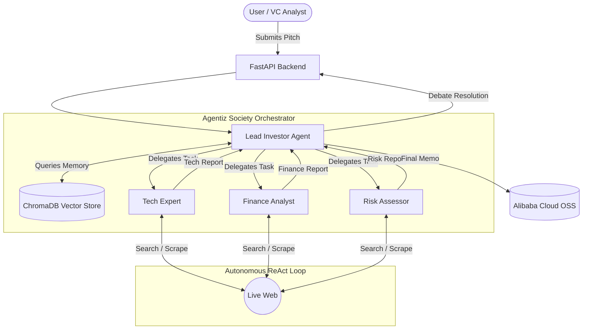

# Agentiz Society 🤖💼
**Autonomous AI Due Diligence Powered by Qwen Cloud & Alibaba OSS**

Venture Capital analysts waste thousands of hours reading scientifically incoherent and financially unviable startup pitches. **Agentiz Society** is a multi-agent orchestration platform that performs rigorous, fully autonomous due diligence on startup pitches in real-time.

## 🌟 Key Features

1. **Multi-Agent Orchestration**: A `Lead Investor` orchestrates a team of specialized experts (`Tech Expert`, `Finance Analyst`, `Risk Assessor`).
2. **Recursive ReAct Agent Loops**: Agents don't just "chat." They execute autonomous loops (Thought → Action → Observation), using DuckDuckGo to search the live internet and scrape URLs to fact-check claims until they reach a definitive conclusion.
3. **Vector Database Memory (RAG)**: The Lead Investor recalls past investment decisions from a local ChromaDB instance to ensure historical consistency.
4. **Alibaba Cloud OSS Integration**: Once a final investment decision is reached, the memo is automatically pushed to an Alibaba Cloud OSS bucket for immutable record-keeping.
5. **AI Pitch Generator**: Need a fake company to test? The frontend includes an AI-powered startup pitch generator powered by Qwen.

## 🏗️ Architecture

## 🚀 How to Run Locally

### Prerequisites
- Python 3.9+
- Node.js 18+
- Alibaba Cloud Account (OSS + Model Studio API Key)

### Quick Start (Windows)
We have provided a convenient batch script that spins up both the frontend and backend servers simultaneously.
1. Clone the repository.
2. Double click the `start_servers.bat` file in the root directory.
3. Open your browser to `http://localhost:5173`.
4. Enter your Qwen API Key and Alibaba OSS credentials in the UI.

*Note: Your credentials are securely persisted in your browser's local storage.*

## 🏆 Hackathon Submission Details
- **Track**: Open Innovation / AI Agents
- **Cloud Infrastructure**: Alibaba Cloud OSS (eu-west-1), Alibaba DashScope (International Endpoint)
- **Model Used**: `qwen-plus`
